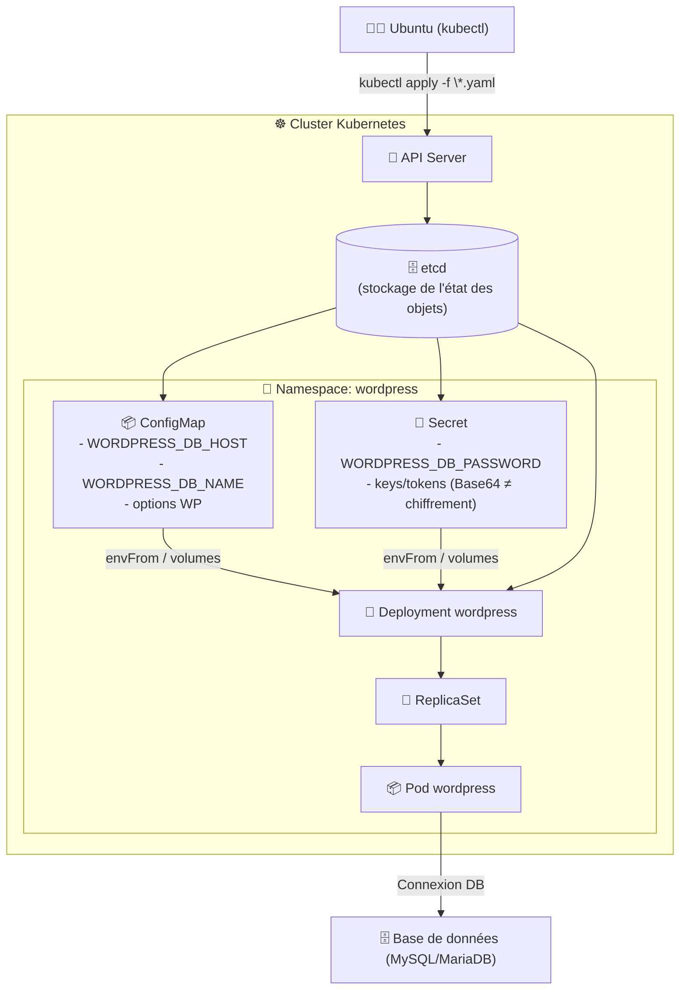

```mermaid
flowchart TB
%% 🎯 Objectif : séparer config non sensible et secrets pour WordPress

subgraph K8S["☸️ Cluster Kubernetes"]
direction TB

    subgraph NS["📁 Namespace: wordpress"]
      direction TB

      CM["📦 ConfigMap\n- WORDPRESS_DB_HOST\n- WORDPRESS_DB_NAME\n- options WP"]
      SEC["🔐 Secret\n- WORDPRESS_DB_PASSWORD\n- keys/tokens (Base64 ≠ chiffrement)"]

      DEP["🚀 Deployment wordpress"]
      RS["🧬 ReplicaSet"]
      POD["📦 Pod wordpress"]

      CM -->|"envFrom / volumes"| DEP
      SEC -->|"envFrom / volumes"| DEP

      DEP --> RS --> POD
    end

    ETCD[("🗄️ etcd\n(stockage de l'état des objets)")]
    API["🧠 API Server"]

    API --> ETCD
    ETCD --> CM
    ETCD --> SEC
    ETCD --> DEP

end

DEV["👨‍💻 Ubuntu (kubectl)"] -->|"kubectl apply -f \*.yaml"| API
POD -->|"Connexion DB"| DB["🗄️ Base de données (MySQL/MariaDB)"]
```
